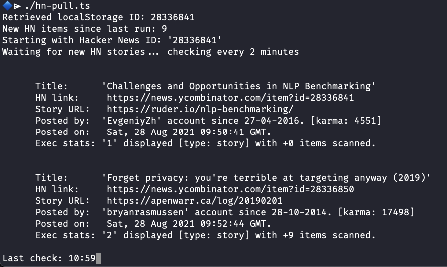

[](https://raw.githubusercontent.com/hyperium/hyper/master/LICENSE)

# hnpull

Deno app to monitor and pull the latest Hacker News stories.



The official web site for [Hacker News](https://news.ycombinator.com/news) can
also show the latest new articles published if preferred.

## Main features of hnpull

The program is written to run in a terminal window and check for any new Hacker
News (HN) articles. Once a new article is found a summary is displayed. The main
benefits are:

- a clear summary of each new article published;
- links to the HN comments and any linked article source;
- records locally the last article retrieved so any new 'missed' ones can
  optionally be retrieved when re-run;
- if a large number of new articles (ie number is shown when run) has
  accumulated - their download can be skipped by default;
- runs forever so can constantly monitor as a background stream if needed;
- only checks periodically so as not to overload the API site.
- runs on _Windows_, _macOS_, _Linux_ - anywhere Deno can run.

**Please use the program responsibly** — do not to overload the _Hacker News
API_ site by running the program for no reason.

## Downloading

Download the program to your computer - the simplest method is to clone this
GitHub repo with `git` as below:

```console
git clone https://github.com/wiremoons/hnpull.git
```

The program is the _TypeScript_ file named: `hnpull.ts`. See below for options
on how to run it.

## Running the program

The program can be run either as a Deno script or as a self contained compiled
program. See information below if needed on **Installing Deno**.

Once the GitHub repo is cloned to you computer, ensure you are in its directory
first.

On operating systems such as _Linux_, _macOS_, and _WSL_ the program can be
executed as a script directly. Just ensure the `hnpull.ts` is made executable
(see `chmod` command below), and then run it directly with: `./hnpull.ts`

```console
chmod 755 hnpull.ts
```

The program can be run with _Deno_ using the command:

```console
deno run --quiet --allow-net=hacker-news.firebaseio.com --location https://wiremoons.com/ ./hn-pull.ts
```

NOTE: the ability to compile the program is not possible due to
[Deno Bug #10693](https://github.com/denoland/deno/issues/10693). Once this is
fixed, the program can be compiled with _Deno_ using the command:

```console
deno compile --quiet --allow-net=hacker-news.firebaseio.com --location https://wiremoons.com/ ./hn-pull.ts
```

### Installing Deno

First ensure you have installed a copy of the `deno` or `deno.exe` program, and
it is in your operating systems path. See the relevant
[Deno install instruction](https://github.com/denoland/deno_install) or just
download the
[Deno latest release version](https://github.com/denoland/deno/releases)
directly.

Install is easy as it is just a single binary executable file - just download a
copy and add it to a directory in your path.

## Development Information

The application in written using the _Deno_ runtime and the _TypeScript_
programming language, so can be used on any operating systems support by _Deno_,
such as _Windows_, _Linux_, _macOS_, etc. More information about Deno is
available here:

- [Deno's web site](https://deno.land/)
- [Deno on GitHub](https://github.com/denoland)

## Licenses

The `hnpull` application is provided under the _MIT open source license_. A copy
of the MIT license file is [here](./LICENSE).

The [Hacker News API](https://github.com/HackerNews/API) is provided under the
_MIT_ open source license. A copy of the license file is
[here](https://github.com/HackerNews/API/blob/665205f324b95f60bc7889b543978f728c274c4a/LICENSE).
